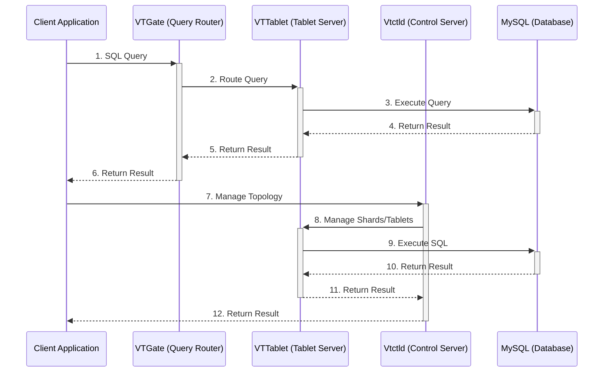

# 数据库分库分表知识

## Vitess 部署节点和客户端使用的流程图，或者时序图

> 

以下是使用 **Sequence Diagram** 表示的 Vitess 部署节点和客户端使用的流程图。该图展示了客户端应用程序与 Vitess 组件（如 VTGate、VTTablet、Vtctld 和 MySQL）之间的交互过程。

---

### 详细说明

1. **Client Application**：
   - 客户端应用程序发起 SQL 查询请求。

2. **VTGate**：
   - VTGate 作为查询路由器，接收客户端请求，并根据 VSchema 和分片信息将查询路由到相应的 VTTablet。

3. **VTTablet**：
   - VTTablet 作为 Tablet Server，接收来自 VTGate 的查询请求，并将其转发到后端的 MySQL 数据库。

4. **MySQL**：
   - MySQL 数据库执行查询并返回结果给 VTTablet。

5. **Vtctld**：
   - Vtctld 是 Vitess 的控制服务器，负责管理拓扑信息、分片和 Tablet 的状态。

6. **交互流程**：
   
- **查询流程**：
 1. 客户端发送 SQL 查询到 VTGate。
 2. VTGate 将查询路由到 VTTablet。
 3. VTTablet 将查询转发到 MySQL。
 4. MySQL 返回结果给 VTTablet。
 5. VTTablet 返回结果给 VTGate。
 6. VTGate 返回结果给客户端。
    
- **管理流程**：
 7. 客户端发送管理请求（如拓扑管理）到 Vtctld。
 8. Vtctld 管理分片和 Tablet 的状态。
 9. VTTablet 执行相关 SQL 操作。
 10. MySQL 返回结果给 VTTablet。
 11. VTTablet 返回结果给 Vtctld。
 12. Vtctld 返回结果给客户端。

---

### 总结

通过上述 **Sequence Diagram**，可以清晰地看到 Vitess 的部署节点和客户端之间的交互流程。VTGate 作为查询路由器，VTTablet 作为 Tablet Server，Vtctld 作为控制服务器，MySQL 作为底层数据库，共同协作完成查询和管理任务。这种架构使得 Vitess 能够高效地处理大规模数据和高并发访问，同时提供了灵活的扩展和管理能力。
